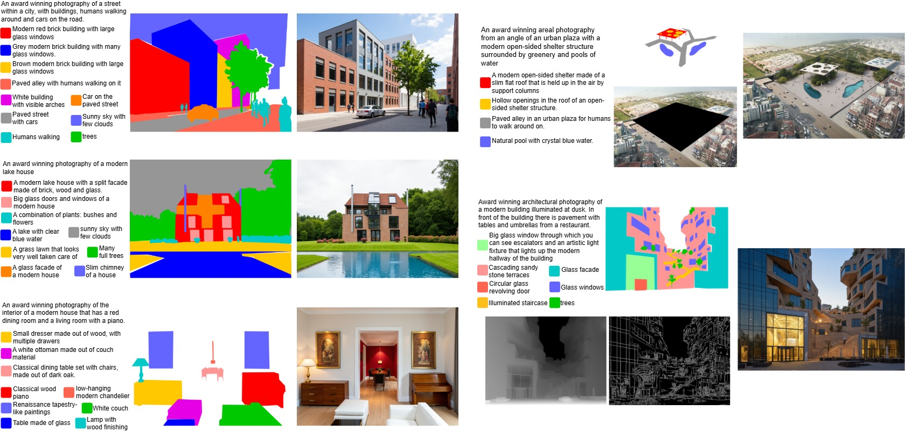

# SpaDiff: Spatial Conditioning Adapter for Open-Vocaulary S2I with MM-DiTs

SpaDiff is an open-vocabulary segmentation-mask-to-image adapter
built on top of FLUX that does not require fine-tuning
the base model. Read the paper at [link].

<p align="center">
  
</p>

 SpaDiff generates high-quality photorealistic images that closely respect the input segmentation mask, while 
 maintaining the flexibility of an adapter of multi-conditioning. _Left_: Generation with only SpaDiff adapter which 
 takes as input a segmentation mask along with corresponding regional prompts and a global prompt. _Right_: Generation 
 with SpaDiff combined with adapters for image inpainting _(top)_ and canny along with depth _(bottom)_.

The framework builds on [Seg2Any](https://github.com/0xLDF/Seg2Any).

---

## Installation

Clone the repository:

```bash
git clone https://github.com/petrapostelnicu/spadiff.git
cd spadiff
```

Tested on **Python 3.10**, **CUDA 12.6**, **PyTorch 2.7.1** (Ubuntu 22.04).

```bash
conda create -n spadiff python=3.10 -y
conda activate spadiff

# 1) PyTorch (CUDA 12.6) install FIRST, from the PyTorch index
pip install torch==2.7.1 torchvision==0.22.1 torchaudio==2.7.1 \
    --index-url https://download.pytorch.org/whl/cu126

# 2) Everything else
pip install -r requirements.txt

# 3) Packages that must skip dependency resolution (they pin incompatible
#    torch/timm; their real deps are already satisfied by step 2)
pip install --no-deps openai-clip image-reward
pip install --no-deps --no-build-isolation git+https://github.com/facebookresearch/sam2.git
```

**Evaluation only** — the semantic-mIoU metric needs mmsegmentation (skip for
training/inference):

```bash
pip install openmim "setuptools<72"
pip install mmengine
pip install --force-reinstall opencv-python-headless
pip install --no-build-isolation "mmcv==2.1.0"
pip install mmsegmentation
```

---

## Pretrained weights

| Weight | Source |
| ------ | ------ |
| FLUX.1-dev (base model) | https://huggingface.co/black-forest-labs/FLUX.1-dev |
| **SpaDiff adapter** | https://huggingface.co/petrapostelnicu/SpaDiff/tree/main |
| SAM 2.1 Hiera-L (eval only, segmentation consistency) | https://huggingface.co/facebook/sam2.1-hiera-large |


---

## Configs

Each training, generation, and evaluation run is driven by one YAML in `model/config/`.

The repository ships **two example configs** that define the final SpaDiff setup, one per
dataset:

- `model/config/unified_adaptive.yaml`: COCO-Stuff (512×512, `cond_scale_factor: 1`)
- `model/config/unified_adaptive_sacap1m.yaml`: SACap-1M (1024×1024, `cond_scale_factor: 2`)

The key `model.*` flags select the method; changing them reproduces every variant and
ablation discussed in the paper:

| Flag | Options | Meaning |
| ---- | ------- | ------- |
| `attention_mask_method` | `adaptive`, `hard`, `base`, `place`, `none` | MM-Attention mask pattern. `adaptive` is SpaDiff's learned masking; `hard` = Seg2Any (SAA + AIA); `base` = SAA only; `place` = PLACE re-implementation; `none` = no mask. |
| `conditional_integration_method` | `unified`, `decoupled`, `none` | How condition tokens are fused with text/image tokens. `unified` is SpaDiff's; `decoupled` uses a separate learned condition→image scale; `none` disables conditioning. |
| `hard_attn_block_range` | e.g. `[19, 37]` | Transformer-block range where Attribute Isolation Attention is applied. Only used when `attention_mask_method: hard`. |
| `zero_init_cond2img` | `true` / `false` | Zero-initialise the condition→image scale. Only relevant when `conditional_integration_method: decoupled`. |

Evaluation behaviour is controlled by the `eval.*` block (`semantic_miou`,
`segmentation_consistency`, `regional_metrics`, …) (see [Evaluation](#evaluation)).

Edit the `data.*` paths in a config to point at your dataset locations before running.

---

## Datasets

SpaDiff trains/evaluates on **COCO-Stuff** (512×512) and **SACap-1M** (1024×1024).

| Dataset | What to get | Source |
| ------- | ----------- | ------ |
| COCO-Stuff 164K | `train2017.zip`, `val2017.zip`, `stuffthingmaps_trainval2017.zip` | https://github.com/nightrome/cocostuff#downloads |
| COCO captions | `captions_train2017.json`, `captions_val2017.json` | https://cocodataset.org/#download |
| SA-1B | raw images as gzipped `.tar` archives | https://ai.meta.com/datasets/segment-anything-downloads/ |
| SACap-1M | `anno_train.parquet` (regional + global captions) | https://huggingface.co/datasets/0xLDF/SACap-1M |
| SACap-eval | `anno_test.parquet` + 4k benchmark test images | https://huggingface.co/datasets/0xLDF/SACap-eval |

The example configs expect the layout below; override the `data.*` / `eval.*` keys to
relocate.

**COCO-Stuff** (`unified_adaptive.yaml`):

```
/data/train2017/                              # train images
/data/val2017/                                # val images
/data/annotations/captions_train2017.json     # COCO captions
/data/annotations/captions_val2017.json
/data_seg/stuffthingmaps_trainval2017/
├── train2017/                                # stuff+thing segmentation maps
├── val2017/
└── val2017_size512/                          # GT labels for mIoU (generated; see Evaluation)
```

**SACap-1M** (`unified_adaptive_sacap1m.yaml`):

```
/data/SACap-1M/
├── annotations/
│   ├── anno_train.parquet     # from SACap-1M
│   └── anno_test.parquet      # from SACap-eval
├── raw/                       # SA-1B .tar archives → converted to .h5 (see below)
├── h5/                        # per-archive HDF5 files (training reads these)
├── test/                      # SACap-eval images (validation)
└── cache/train/               # group_bucket.parquet (see Training)
```

### SACap-1M: convert tar archives to HDF5

SA-1B ships as gzipped `.tar` archives, which are  slow to random-access from the
dataloader. Convert each `.tar` to a per-archive `.h5`, which is the format the SACap-1M dataset
reads when `use_h5_files: True` (set in the config):

```bash
python model/scripts/migrate_tars_to_hdf5.py /data/SACap-1M/raw --h5-dir /data/SACap-1M/h5
```

> **This is destructive**: each `.tar` is deleted once its `.h5` is written and verified
> (designed for when disk can't hold both copies). Use `--dry-run` to preview, and
> `--array-id` / `--array-count` to shard the conversion across parallel jobs.

---

## Training

Configure `accelerate` once for your hardware (number of GPUs, mixed precision, optionally
DeepSpeed ZeRO-2):

```bash
accelerate config        # writes ~/.cache/huggingface/accelerate/default_config.yaml
```

For multi-GPU training under tight memory, choose **DeepSpeed ZeRO-2** during
`accelerate config` (accelerate manages the DeepSpeed plugin, so no separate DeepSpeed
config file is shipped). The training config additionally exposes memory knobs:
`trainer.gradient_checkpointing` (on by default), `trainer.offload` (offload params/optimizer
state to CPU), and `trainer.gradient_accumulation_steps`.

### (Optional) Pre-compute the group-bucket map

To avoid wasting compute on padding tokens, samples are bucketed by condition-image and
text token counts. Enable in the dataset config with `is_group_bucket: True` + a
`cache_root`. Pre-compute the bucket cache **once per dataset** (otherwise training builds
it lazily on first run, which is slow). For example, for COCO-Stuff:

```bash
python model/scripts/prepare_dataset_bucket_map.py model/config/unified_adaptive.yaml
```

(and likewise `model/config/unified_adaptive_sacap1m.yaml` for SACap-1M).

This writes `<cache_root>/{H}H_{W}W-group_bucket.parquet`, reused automatically on later
runs. Re-run it if you change `resolution` or `cond_scale_factor` (the bucket map depends on
the condition resolution).

To save time, you can download the pre-built SACap-1M bucket map from
[HuggingFace](https://huggingface.co/datasets/0xLDF/SACap-1M/tree/main/cache/train).

### Launch training

`train.py` takes the config as a **positional** argument:

```bash
accelerate launch model/scripts/train.py \
    model/config/unified_adaptive_sacap1m.yaml \
    --output_dir=outputs/unified_adaptive_sacap1m
```

Useful flags: `--resume_from_checkpoint=<ckpt_dir>` to continue a run, and
`--init_adaptive_mask_from=<ckpt_dir>` to warm-start the adaptive-mask module from an
earlier checkpoint.

---

## Generation

`generate_image.py` runs the trained adapter over a config's validation set and writes
images to `group_0/`, `group_1/`, …

```bash
accelerate launch model/eval/generate_image.py \
    --base model/config/unified_adaptive_sacap1m.yaml \
    --project.gen_image_dir=outputs/unified_adaptive_sacap1m/gen_imgs \
    --resume_from_checkpoint=<adapter_checkpoint_dir>
```

---

## Evaluation

Computes FID, CLIP score, PickScore, ImageReward, MANIQA, region-quality (Qwen2-VL),
segmentation consistency (SAM 2), and COCO-Stuff semantic mIoU (mmsegmentation).

### (COCO-Stuff only) Prepare ground-truth labels — run once

```bash
python model/eval/convert_coco_stuff164k.py \
    --input_folder=<coco>/stuffthingmaps_trainval2017/val2017 \
    --output_folder=<coco>/stuffthingmaps_trainval2017/val2017_temp
python model/eval/convert_labelsize_512.py \
    --input_folder=<coco>/stuffthingmaps_trainval2017/val2017_temp \
    --output_folder=<coco>/stuffthingmaps_trainval2017/val2017_size512
```

### Run evaluation

```bash
python model/eval/evaluate.py \
    --base model/config/unified_adaptive_sacap1m.yaml \
    --project.gen_image_dir=outputs/unified_adaptive_sacap1m/gen_imgs \
    --project.output_dir=outputs/unified_adaptive_sacap1m \
    --eval.seg_map_dir=<coco>/stuffthingmaps_trainval2017/val2017_size512 \
    --eval.sam2_checkpoint=<sam2.1_hiera_large.pt>
```

Results are written to `<output_dir>/evaluation_results.json`. Individual metrics are toggled
by `eval.*` keys in the config (`semantic_miou`, `segmentation_consistency`, `maniqa`,
`regional_metrics`, …); semantic mIoU additionally needs the mmsegmentation install above
and `--eval.sam2_checkpoint` is required for segmentation consistency.

---

## Single-mask inference

For ad-hoc generation from a folder of mask/caption inputs (no dataset config). Ready-to-run
examples are in [`example_inference_inputs/`](example_inference_inputs): `house_on_lake` is a seg-only sample.

```bash
python model/scripts/infer.py \
    --pretrained_model_name_or_path=black-forest-labs/FLUX.1-dev \
    --resume_from_checkpoint=<adapter_checkpoint_dir> \
    --input_dir=example_inference_inputs \
    --output_path=outputs/infer \
    --num_seeds=4 \
    --cond2image_attention_weight=1.0
```

`--cond2image_attention_weight` (default `1.0`) tunes the **conditioning strength**. Lower it to loosen how
strictly the output follows the segmentation mask; raise it to tighten adherence.

---

## Multi-conditioning inference

`multi_conditioning/` combines the SpaDiff segmentation adapter with one or more
[OminiControl](https://github.com/Yuanshi9815/OminiControl) FLUX adapters (canny, depth,
fill/inpainting, subject, …) **at inference time, with no retraining**. Each extra control
is a frozen OminiControl LoRA layered onto the same FLUX.1-dev backbone.

### Download the OminiControl adapters

Grab the FLUX LoRA weights for the controls you want from OminiControl: https://huggingface.co/Yuanshi/OminiControl

### Input layout

Same `(image, json)` pairs as [single-mask inference](#single-mask-inference) (mask image +
global/regional prompts). For each OminiControl stream `<NAME>`, add a per-sample control
image named `<stem>_<NAME>.<ext>` in the same folder. The `office` sample in
[`example_inference_inputs/`](example_inference_inputs) demonstrates this with a canny stream:

```
example_inference_inputs/
├── house_on_lake.PNG    # segmentation mask  ┐ seg-only sample
├── house_on_lake.json   # prompts            ┘
├── office.PNG           # segmentation mask  ┐
├── office.json          # prompts            ├ seg + canny sample
└── office_canny.png     # control image for the "canny" stream  ┘
```

### Run

Each `--omini NAME <lora_path>` adds one control stream; its control image is
auto-loaded from `<stem>_<NAME>.<ext>` (e.g. the `canny` stream below reads `office_canny.png`):

```bash
python multi_conditioning/scripts/infer.py \
    --input_dir=example_inference_inputs \
    --resume_from_checkpoint=<spadiff_adapter_checkpoint_dir> \
    --output_path=outputs/multicond \
    --omini canny <path/to/canny.safetensors> \
    --num_seeds=4 \
    --cond2image_attention_weight=1.0 \
    --offload sequential
```

- `--resume_from_checkpoint` is the SpaDiff seg adapter checkpoint (contains `cond/`, plus
  optional `adaptive_mask_module.pt` / `cond2img_scale.pt`).
- Omit all `--omini` flags to run seg-only.
- `--cond2image_attention_weight` (default `1.0`) tunes the **segmentation conditioning
  strength** (img↔cond attention weight); `--omini_cond_weights w1 w2 …` sets the analogous
  per-stream strength for each OminiControl control (default `1.0` each).
- `--omini_subject_streams NAME …` marks reference-image (subject) streams.
- `--offload {none,model,sequential}` trades speed for VRAM — use `sequential` when running
  seg + several control streams on a smaller GPU.

---

## Acknowledgements

Built on [FLUX.1-dev](https://huggingface.co/black-forest-labs/FLUX.1-dev) and the
[Seg2Any](https://github.com/0xLDF/Seg2Any) framework. The SACap-1M dataset and the
mmsegmentation-based mIoU evaluation follow Seg2Any. Multi-conditioning inference uses
[OminiControl](https://github.com/Yuanshi9815/OminiControl) adapters.
